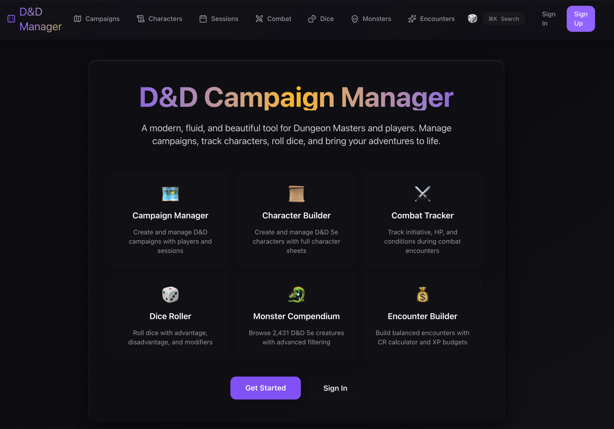
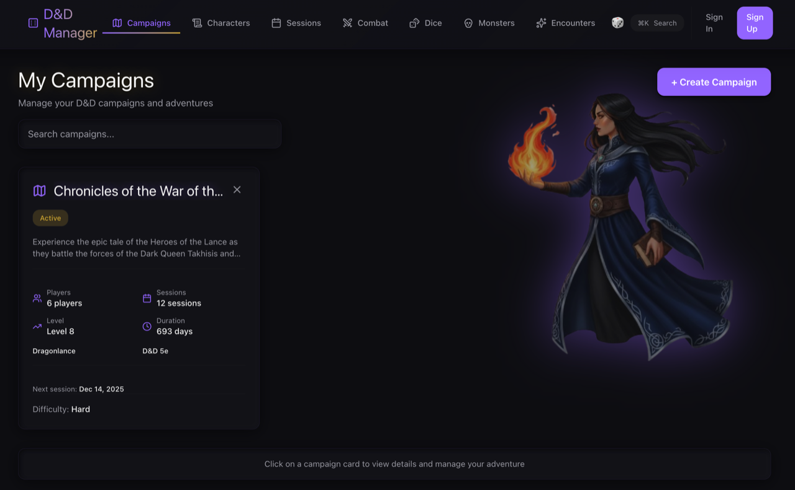
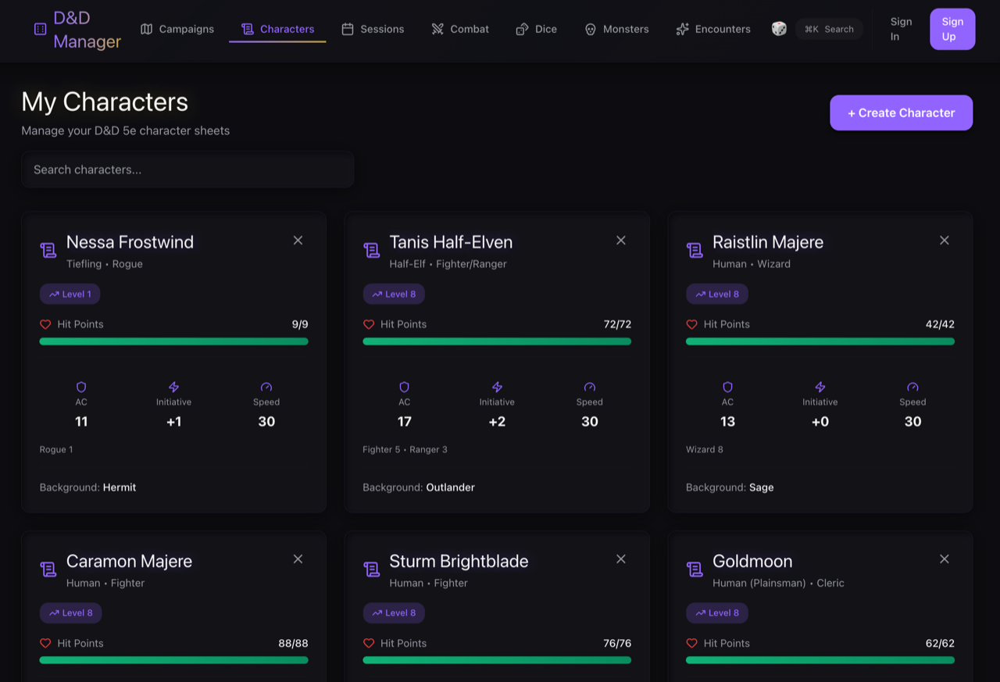
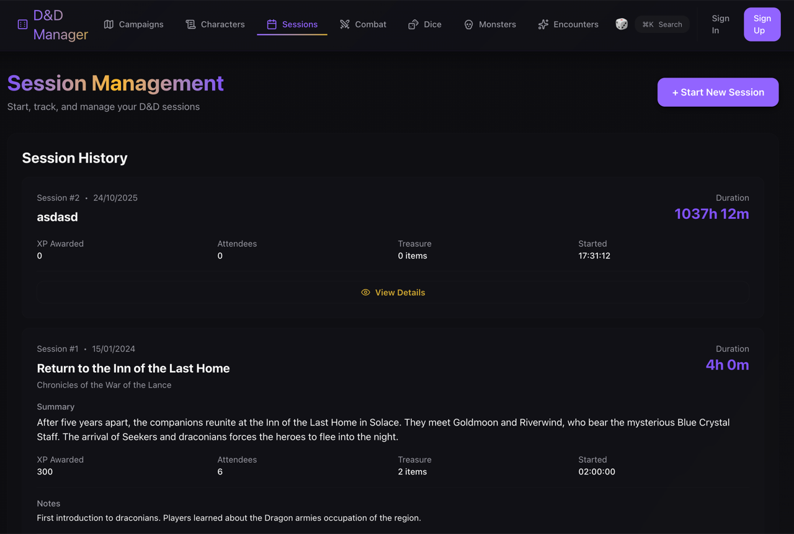
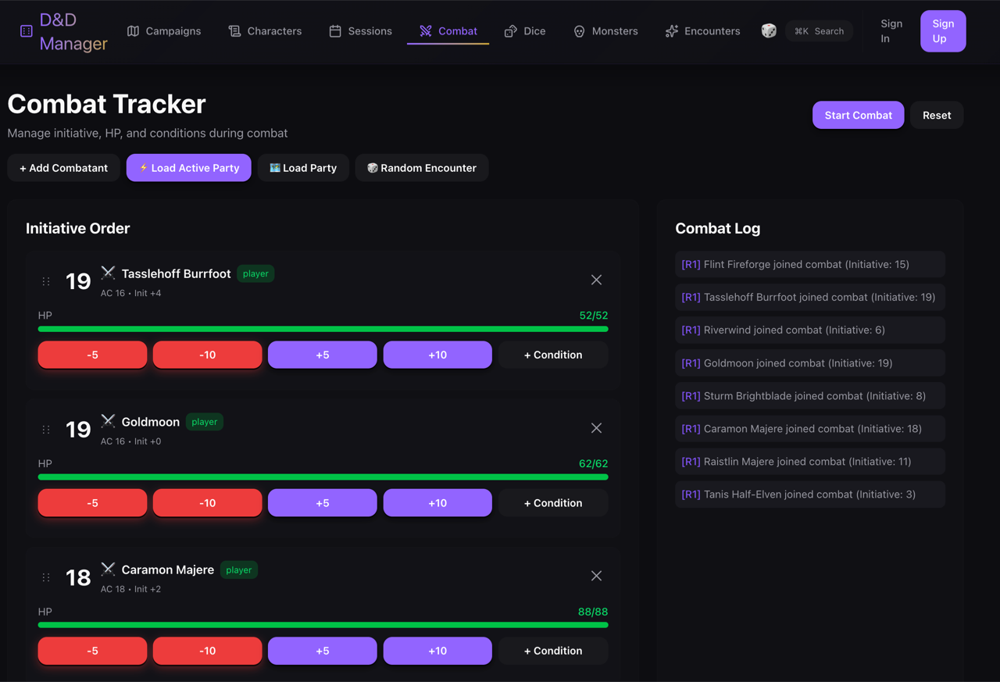
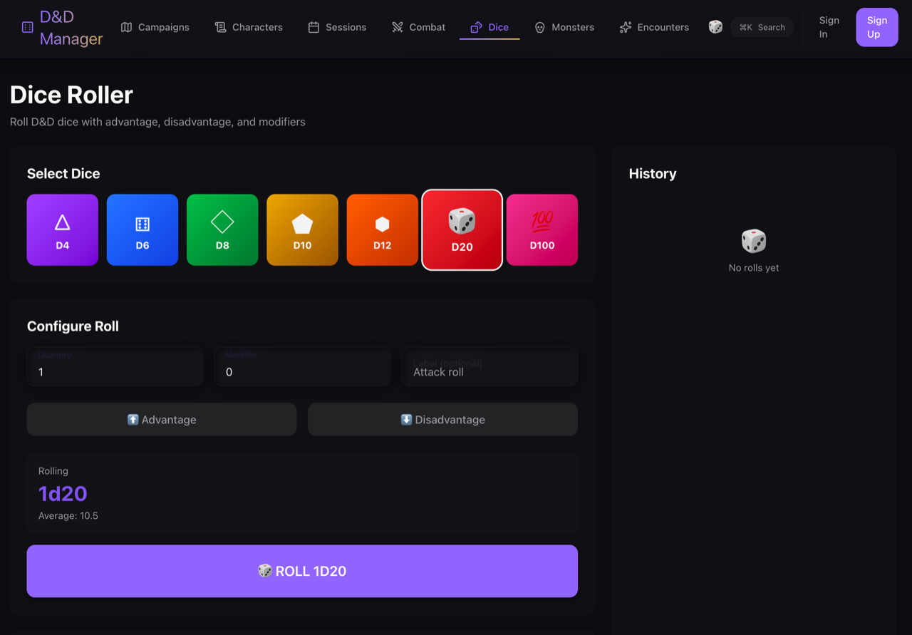
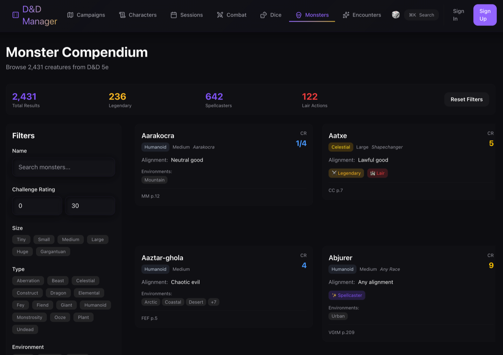

# D&D Campaign Manager

A modern, fluid, and beautiful web application for managing Dungeons & Dragons 5th Edition campaigns. Built for both gamemasters and players with a dark-mode-first design and glass morphism UI.



## Feature Highlights

### Implemented
- **Campaign Dashboard** – Personalized dashboard with recent campaigns, quick actions, and links into campaign tools.
- **Campaign Toolkit** – NPC, location, quest, and session management with relationship tracking, status tags, and rich notes.
- **Character Management** – Full character sheets, ability and skill calculations, inventory tracking, death saves, spell slots, and short/long rest mechanics.
- **Combat Tracker** – Initiative timeline with drag-and-drop ordering, HP management, conditions, combat log, and round tracking.
- **Monster Compendium** – Searchable database of 2,400+ monsters with advanced filters, detail modal, and encounter builder workflow.
- **Dice Roller** – Advantage/disadvantage support, modifiers, roll history, and quick-access widget.
- **Local-First Architecture** – Fully functional offline mode with local data persistence for rapid prototyping and solo play.

### Planned & Upcoming
- **Authentication & Roles** – Supabase email/password auth, Google & Facebook OAuth (Currently disabled for local preview).
- Real-time collaboration and shared campaign state
- Campaign invitations and sharing
- Advanced quest chains and visualization
- Enhanced mobile gestures and touch-first drag/drop
- PWA installability and offline sync
- Cloud persistence via Supabase

## Tech Stack

- **Next.js 15** - React framework with App Router and Server Components
- **TypeScript** - Type-safe development
- **Supabase** - Backend as a Service (Auth, PostgreSQL, Real-time)
- **PWA Ready** - Offline support and installable (Planned)

## Gallery

| Campaign Overview | Character Management |
|:---:|:---:|
|  |  |

| Combat Tracker | Monster Compendium |
|:---:|:---:|
|  |  |

| Encounter Builder | Dice Roller |
|:---:|:---:|
|  |  |

## Getting StartedOffline support and installable (Planned)

## Getting Started

### 1. Install dependencies

```bash
npm install
```

### 2. Set up Supabase (Optional)

For local development and testing, Supabase is optional. The app will run in local-only mode.
To enable cloud features:

1. Create a Supabase project at [https://supabase.com](https://supabase.com)
2. Copy `.env.local.example` to `.env.local`
3. Add your Supabase URL and keys to `.env.local`
4. Run the database migration (see `supabase/SETUP.md` for detailed instructions)

### 3. Run the development server

```bash
npm run dev
# OR using Make
make dev
```

Open [http://localhost:3000](http://localhost:3000) in your browser.

## Development Commands

This project includes a Makefile for convenient development workflows:

```bash
# Show all available commands
make help

# Development
make dev              # Start dev server
make build            # Production build
make start            # Start production server

# Testing
make test             # Run Jest unit tests
make test-e2e         # Run Playwright E2E tests
make test-all         # Run all tests
make test-coverage    # Tests with coverage

# Quality
make lint             # Run ESLint
make check            # All quality checks
make deploy-check     # Full pre-deployment verification

# Utilities
make clean            # Clean build artifacts
```

Or use npm commands directly:
```bash
npm run dev          # Development server
npm run build        # Production build
npm test             # Jest tests
npm run test:e2e     # Playwright tests
npm run lint         # ESLint
```

### 4. Configure OAuth (Optional)

To enable Google/Facebook login:
- Follow the instructions in `supabase/SETUP.md`
- Configure OAuth apps in Google Cloud Console and Facebook Developers
- Add OAuth credentials to Supabase dashboard

## Docker

A production image is published to the GitHub Container Registry on each tagged release.

Pull and run the latest release:

```bash
docker run -p 3000:3000 \
  -e NEXT_PUBLIC_SUPABASE_URL=https://your-project.supabase.co \
  -e NEXT_PUBLIC_SUPABASE_ANON_KEY=your-anon-key \
  -e SUPABASE_SERVICE_ROLE_KEY=your-service-role-key \
  ghcr.io/mangobanaani/dnd:latest
```

The app is then available at http://localhost:3000.

Because Next.js inlines `NEXT_PUBLIC_*` values into the client bundle at build time,
the published image is built with the registry's configured values. To bake in your
own Supabase project, build the image yourself:

```bash
docker build \
  --build-arg NEXT_PUBLIC_SUPABASE_URL=https://your-project.supabase.co \
  --build-arg NEXT_PUBLIC_SUPABASE_ANON_KEY=your-anon-key \
  -t dnd-campaign-manager .
```

Tags follow semver: `latest`, `0`, `0.1`, and `0.1.0`.

## Project Structure

```
dnd-campaign-manager/
├── app/
│   ├── (auth)/          # Authentication pages
│   ├── (dashboard)/     # Main app pages
│   ├── components/      # React components
│   ├── lib/            # Utility functions
│   ├── types/          # TypeScript types
│   ├── globals.css     # Global styles + theme variables
│   ├── layout.tsx      # Root layout with theme provider
│   └── page.tsx        # Homepage
├── public/             # Static assets
└── ...config files
```

## Documentation & Roadmap

- `TODO.md` – Active sprint plan, backlog, and ideas
- `SESSION-SUMMARY.md` – Latest development session recap
- `FEATURES.md` – Deep dive into subsystems and UI flows
- `LOCAL-DEV.md` – Running without Supabase in offline mode
- `MONSTER-DATA.md` – Monster data sourcing and processing

## Theming System

The app uses a sophisticated theming system with CSS variables:

- **Dark mode first** - Optimized for low-light D&D sessions
- **Glass morphism** - Subtle transparency and backdrop blur
- **Smooth animations** - Fade, slide, and scale transitions
- **Customizable** - Easy to adjust colors via CSS variables

Theme classes available:
- `.glass` - Standard glass effect
- `.glass-strong` - More opaque
- `.glass-subtle` - Very subtle

## Customizing the Theme

Edit theme colors in `app/globals.css`:

```css
.dark {
  --primary: 263 70% 50%;    /* Purple for magic */
  --accent: 45 100% 51%;     /* Gold highlights */
  --success: 142 71% 45%;    /* Green for healing */
  --destructive: 0 84% 60%;  /* Red for damage */
}
```

## License

MIT

## Contributing

- Fork the repo, create a feature branch, and aim for focused pull requests.
- Run quality checks before opening a PR:
  ```bash
  make check           # Run all checks (lint + tests)
  # OR
  npm run lint && npm test && npm run test:e2e
  ```
- Follow the established directory structure under `app/` for new routes or feature areas.
- Add or update documentation (`README.md`, `TODO.md`, dedicated guides) when behavior changes.
- Record notable progress in `SESSION-SUMMARY.md` or the sprint notes inside `TODO.md`.

Need ideas? Check the "Active Sprint" and "Backlog" sections in `TODO.md` for the current priorities.

### Pre-Deployment Checklist

Before deploying to production, run the comprehensive verification:

```bash
make deploy-check
```

This runs:
1. ESLint for code quality
2. TypeScript build for type checking
3. All unit tests
4. All E2E tests

See `DEPLOYMENT-CHECKLIST.md` for the complete manual verification guide.

---

**Roll for initiative!** 🎲
